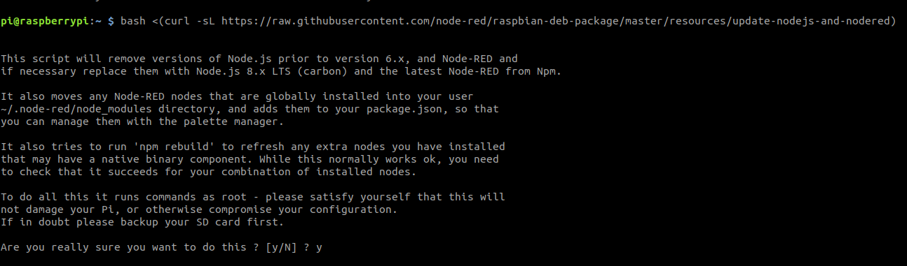
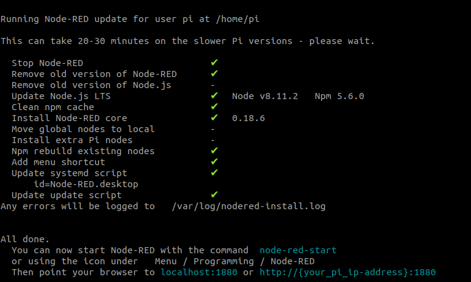
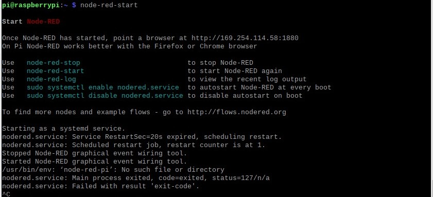
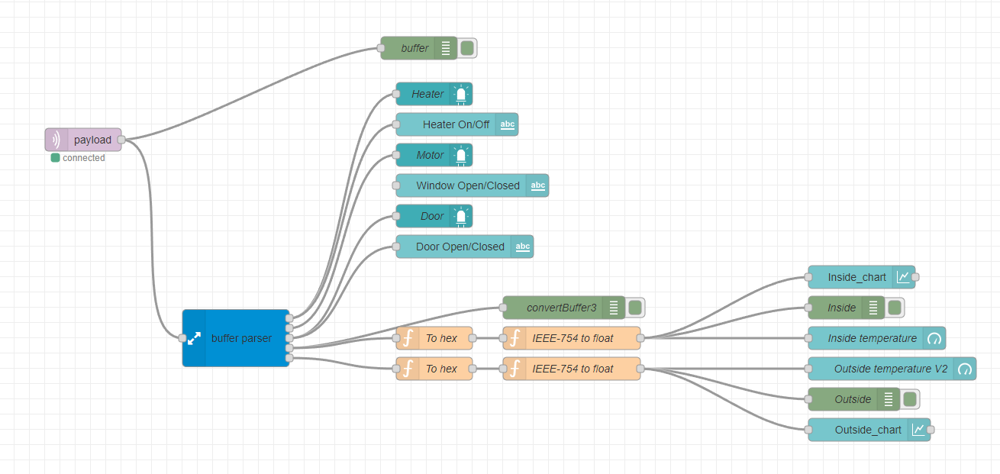
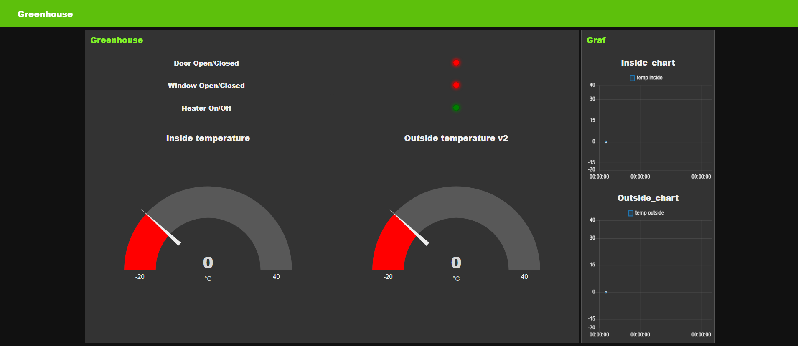

# How to install Node-RED in Raspberry Pi

Start building your IoT solutions using Node-RED

## Requirements

- Raspberry Pi already configured and connected to internet

## Setting up NodeRed

1. To start the installation, access the Raspberry Pi via your prefered method. This can be done using the Desktop Interface (connecting a monitor, keyboard, and mouse to the Raspberry Pi), or simply by accessing the Pi Remotely using your computer’s terminal as a secure shell, or SSH.

2. Once you have access to the Raspberry Pi, update the list of available packages and their versions to start your solution with everything up-to-date.

```bash
sudo apt-get update
```

3. Install the latest version of packages - previously updated (step 2)

```bash
sudo apt-get upgrade
```

This will take a couple of minutes!

## Install/Upgrade Node-RED

1. Node-RED comes pre-installed on the full Raspbian SD image card. While usable, this uses an older version of Node.js. We recommend upgrading to the latest version by running the below command in the Pi’s terminal:

```bash
bash <(curl -sL https://raw.githubusercontent.com/node-red/raspbian-deb-package/master/resources/update-nodejs-and-nodered)
```

2. Once your image card has been updated, confirm the installation by inserting Y  when asked for verification.

<!--  -->


Once the installation is finished, you will receive the following verification:



## Running Node-RED

1. To start Node-RED:

- **Remotely from your Computer&#39;s Terminal** : Run node-red-start in a new Raspberry Pi terminal window.

2. Once the command is inserted wait a couple seconds until the Node-RED server starts running. As you can see on the image below the terminal logs lets you know the device IP and port where that the Node-RED server will be pointing.

The service is pointing to port **1880** : [http://{your\_pi\_ip-address}:1880](http://{your\_pi\_ip-address}:1880)

3. Once the Node-RED program has started, open a web-browser of your preference and in the URL navigation bar write the address shown in the first main line of your Node-RED terminal as captured below.



4. To acces the Node-RED web interface use the [http://{your\_pi\_ip-address}:1880](http://{your\_pi\_ip-address}:1880).





## **Common Commands when using Node-RED with Raspberry Pis**

1. To see the log, run the command:

```bash
node-red-log
```

2. If you want Node-RED to run when the Pi boots up you can use:

```bash
sudo systemctl enable nodered.service
```

3. To stop Node-RED, run the command. Note: closing the window (or ctrl-c) does not stop Node-RED running. The program will continue running in the background unless you execute a -stop command.

```bash
node-red-stop
```

### Node Red Code

[Node Red Code](/Node-Red/Node-red.js)

- Extra Palette to install
    - node-red
    - node-red-contrib-buffer-parser
    - node-red-contrib-ui-led
    - node-red-dashboard
    - node-red-contrib-ui-artless-gauge
