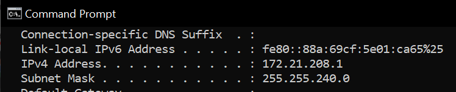
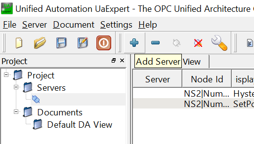
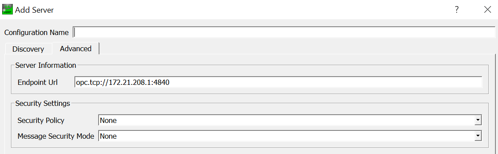
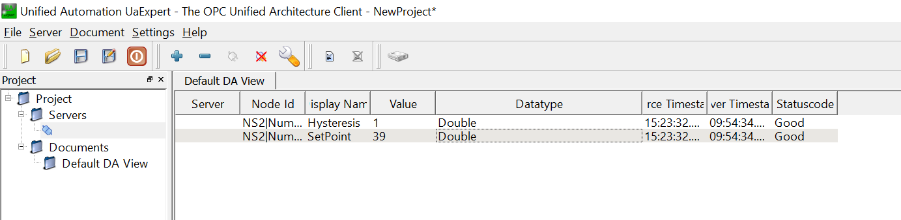
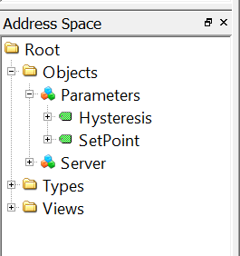

# How to install OPC ua on Raspberry pi

## Install 


2. Once you have access to the Raspberry Pi, update the list of available packages and their versions to start your solution with everything up-to-date.

```bash
sudo apt-get update
```

3. Install the latest version of packages - previously updated (step 2)

```bash
sudo apt-get upgrade
```

4. This will take a couple of minutes!

```bash 
sudo pip3 install cryptography
```
5. Than install opcua and request lib.

```bash 
sudo pip3 install opcua
sudo pip3 install requests
```

## setup server.py

```bash
sudo nano server.py
```

In the link below is the code for the server. 
[code](/OPCUA/Server.py)

```python
# This needs to be IP of device server is running on
url = "opc.tcp://172.21.208.1:4840"
```

#### PC
```bash
ipconfig /all
```


#### RPI
```bash
ifconfig
```

## Run server
```bash 
python3 server.py
```
## Software windows

To see what happens on server. You can install a tool called UAexpert. 

### Setup 






## Errors
The weather api is a free api. This means limitation of requests. 
If this happens. There is a second [Server_No_API](./Server_No_API.py) file. This generate random temperature.