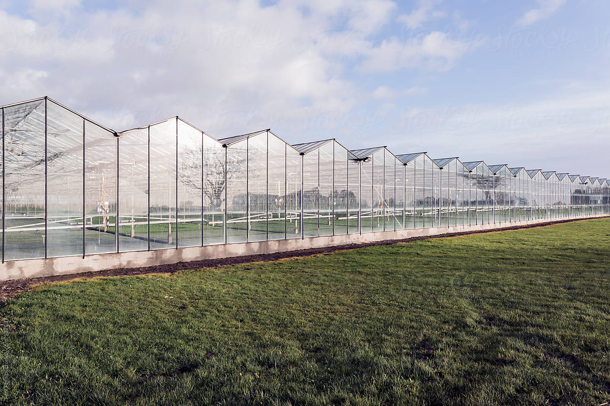
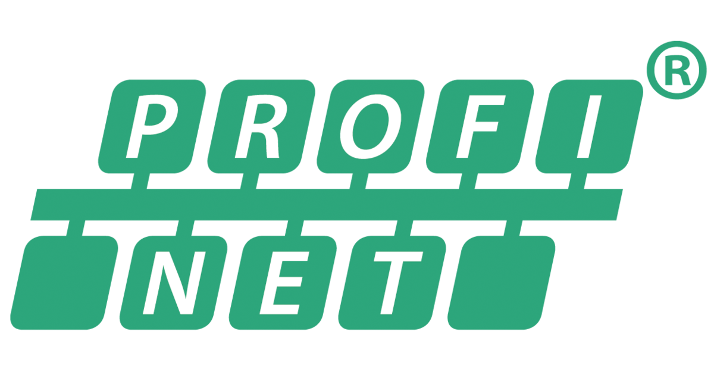
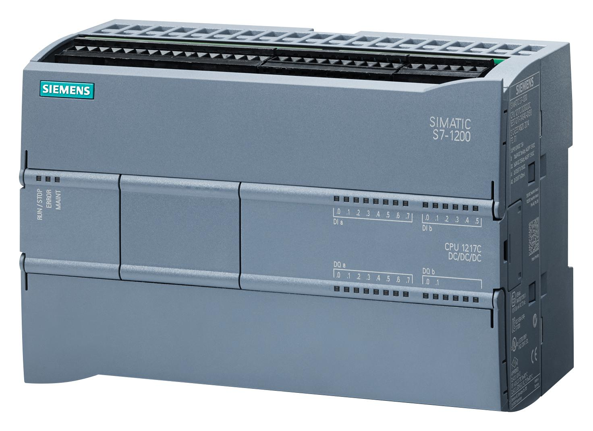
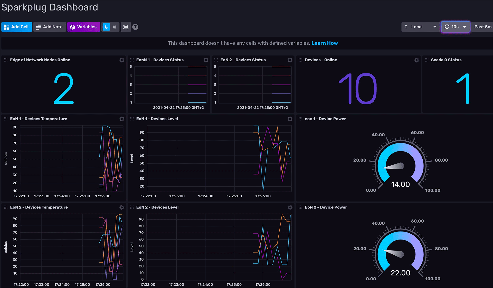

# SIN-Greenhouse

Project Week 2022 Greenhouse

SIN Greenhouse

- Given:
  - Industrial Ethernet - Profinet
  - Sensor - Actuator
  - PLC
  - Industrial router
- Goals:
  - Dashboard
    - MQTT
  - Cybersecurity analysis
    - Scanning tools
    - Spoofing
    - Countermeasures

